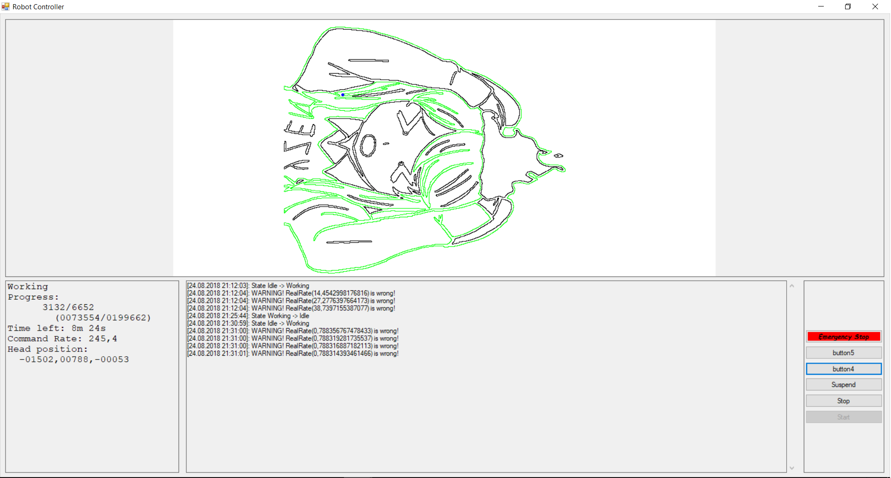
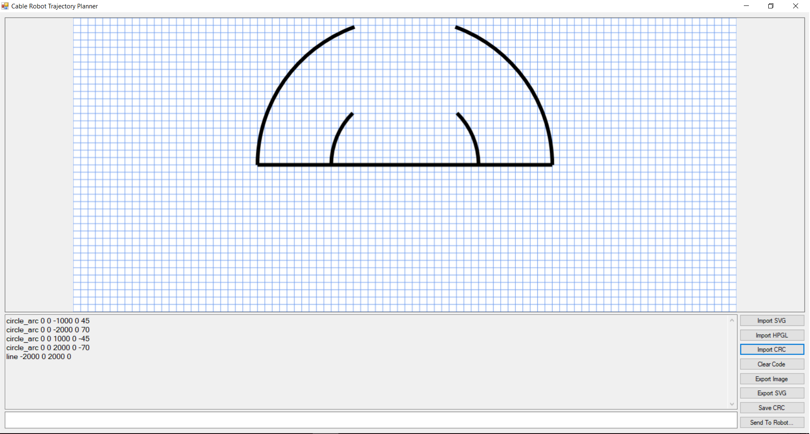

# CableRobot

CableRobot is trajectory planner and execution controller for cable robot in Innopolis University

Depends on OmronFinsUDP.Net library

Has basic support of hpgl file format (`HpglParser.cs`) and VERY basic support of SVG format (`SvgParser.cs`)

Also this introduces own vector file format (an intermediate one) - CRC. `CableRobotTrajectories` contains some samples of such files

# A brief algorithm of work:

- Stage 1, `TrajectoryForm.cs`
	0. Parse Svg or Hpgl and convert it to crc
	
	1. Parse Crc to Commands (`CrcParser.cs`, `Command.cs` and `CommandType.cs`)

	2. Convert commands to robot movements (coordinates) (`CoordinateComputer.cs`)

	3. Use inverse kinematics to compute Angles of motors for points (`InverseKinematicsComputer.cs`) (!BROKEN!)
- Stage 2, `RobotControllerForm.cs`
	1. Use OmronFinsUDP.Net library to write these angles to robot (`RobotController.cs`, `AngleSender.cs`)

# Extra notes

## High CPU comsumtion on Windows

If you are running windows this program will use busy sleep to improve timings

## The math is (most probably) broken

There were no enough time to test and debug program, but `InverseKinematicsComputer.cs` does something wrong. Use some matlab models to test it before running on real robot

